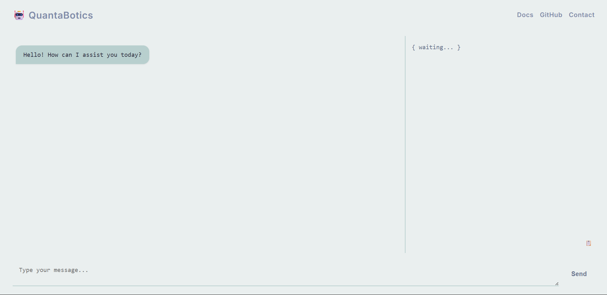

# QuantaBotics — Multi-Agent Intelligence Hub

QuantaBotics is a modular FastAPI-based AI assistant system that routes user inputs to intelligent agents for summarizing, calculating, coding, searching, visualizing, and more. It features a modern web UI and a flexible agent orchestration backend.



---

## 🚀 Features

- **Multi-agent orchestration**: Modular agents for summarization, code generation, calculation, search, sentiment analysis, visualization, event & keyword extraction.
- **Modern web UI**: Interactive chat interface with real-time agent logs and output.
- **Extensible**: Easily add new agents for custom tasks.
- **API-first**: Clean REST endpoints for integration.

---

## 📁 Project Structure

```
multiganet_web/
  main.py                # FastAPI app & agent orchestration
  agents/                # All agent implementations
    summarizer_agent.py
    calculator_agent.py
    code_generator_agent.py
    ...
  util/
    tools.py             # Shared utilities, codegen, message bus
  static/
    script.js            # Frontend JS logic
    style.css            # (Optional) Extra CSS
    docs.html            # Usage documentation
  templates/
    index.html           # Main web UI
scripts/
  run.bat                # Windows startup script
environment/             # Python virtual environment
test.py                  # CodeGen model test
tester.py                # Fibonacci test script
oldmain.py               # Legacy orchestrator example
.env                     # Environment variables file (in base folder)
requirements.txt         # Python dependencies
install.bat              # Windows install script
```

---

## ⚙️ Installation

1. **Clone the repo**  
   ```sh
   git clone <repo-url>
   cd <repo-folder>
   ```

2. **Set up Python environment and install dependencies**  
   On Windows, run:
   ```sh
   install.bat
   ```
   Or manually:
   ```sh
   python -m venv environment
   call environment\Scripts\activate
   pip install --upgrade pip
   pip install -r requirements.txt
   ```

3. **Configure environment variables**  
   Edit the `.env` file in the base folder with your settings:
   ```
   APP_HOST=127.0.0.1
   APP_PORT=8000
   SECRET_KEY=your_secret_key_here
   HF_API_KEY=your_huggingface_api_key_here
   OPENAI_API_KEY=your_openai_api_key_here
   LOG_LEVEL=INFO
   ```

---

## 🖥️ Running the App

### Windows (with provided script)
```sh
scripts\run.bat
```

### Manual (any OS)
```sh
cd multiganet_web
uvicorn main:app --reload
```
Open [http://localhost:8000](http://localhost:8000) in your browser.

---

## 🧠 How It Works

- **User input** is routed by prefix to the correct agent:

| Prefix         | Routed To           | Agent Name                  |
|--------------- |--------------------|-----------------------------|
| `code:`        | Code Generator      | agent5_code_writer          |
| `search:`      | Web Searcher        | agent6_web_searcher         |
| `sentiment:`   | Sentiment Analyzer  | agent7_sentiment_analyzer   |
| `visualize:`   | Data Visualizer     | agent8_data_visualizer      |
| `events:`      | Event Extractor     | agent9_event_extractor      |
| `keywords:`    | Keyword Extractor   | agent10_keyword_extractor   |
| Math expr      | Calculator          | agent4_calculator           |
| Default        | Summarizer → Format | summarizer → agent3_task    |

- **Agent message format**:
  ```json
  {
    "sender": "agent1",
    "receiver": "agent5_code_writer",
    "task": "generate_code",
    "content": "code: reverse string"
  }
  ```

- **API Endpoints**:
  - `GET /` — Web UI
  - `POST /run` — Run agent pipeline (`{"input": "<your prompt>"}`)

---

## 💡 Sample Inputs

| Input                                | Agent Triggered      |
|-------------------------------------- |----------------------|
| `code: create a binary search`        | Code Generator       |
| `search: latest AI news`              | Web Searcher         |
| `sentiment: I love it`                | Sentiment Analyzer   |
| `visualize: {"A": 10, "B": 20}`       | Data Visualizer      |
| `events: from article`                | Event Extractor      |
| `keywords: this paragraph`            | Keyword Extractor    |
| `5 * (2 + 3)`                         | Calculator           |
| `Tell me about AI`                    | Summarizer           |

---

## 🛠️ Adding a New Agent

1. Create `agents/agent11_language_translator.py`
2. Define a function `agent11_task(msg)`
3. Add it to `agent_registry` in `main.py`
4. Add input routing logic in `agent1_task()`

---

## 🌱 Environment Variables

This project uses [python-dotenv](https://pypi.org/project/python-dotenv/) to load environment variables from the `.env` file in the base folder.  
The app checks for `.env` and loads it automatically at startup.

---

## 📄 Documentation

See `static/docs.html` or click "Docs" in the web UI.

---

## 📩 Contact

- Email: [abhijat789@gmail.com](mailto:abhijat789@gmail.com)
- GitHub: [Abhijat-Abhijat](https://github.com/Abhijat-Abhijat)

---

## License

MIT (see LICENSE file if present)
